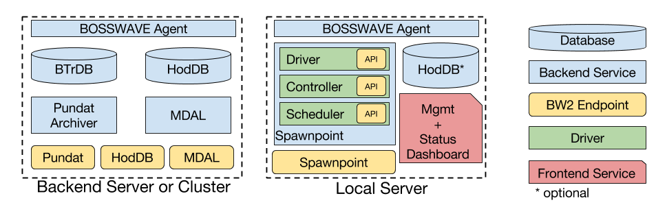

# XBOS Service Architecture

</img>

## Core Infrastructure

These services *can* be run on a local node, but we recommend to run these on a more capable server or cluster.

### BTrDB

We currently only support [BTrDB](http://btrdb.io/) as our timeseries storage backend.
There are instructions for a single-machine development setup [here](https://docs.smartgrid.store/development-environment.html), but for a production installation we recommend the [full installation](https://docs.smartgrid.store/).

### Pundat

[Pundat](https://github.com/gtfierro/pundat) subscribes to data published over BOSSWAVE and saves it in BTrDB.
Pundat should be run on the same cluster or node as your BTrDB installation.


#### Run with Kubernetes

If you are running Kubernetes on your node/cluster, then you can easily install Pundat by using its Kubernetes file

```bash
curl -O https://github.com/gtfierro/pundat/blob/master/kubernetes/pundat.yaml
# edit pundat.yaml
kubectl create -f pundat.yaml
```

#### Run with Docker

If you are not running Kubernetes, you can invoke the Pundat container directly

```bash
# install jq:  https://stedolan.github.io/jq/
docker run -d --name pundat-mongo mongo:latest
MONGOIP=$(docker inspect pundat-mongo | jq .[0].NetworkSettings.Networks.bridge.IPAddress | tr -d '"')
docker run -d --name pundat -e BTRDB_SERVER=<btrdb ip>:4410 \
                            -e MONGO_SERVER=$MONGOIP:27017 \
                            -e GILES_BW_ENTITY=/etc/pundat/<archiver entity.ent> \
                            -e GILES_BW_NAMESPACE=<namespace to deploy on> \
                            -e GILES_BW_ADDRESS=172.17.0.1:28589 \
                            -e GILES_BW_LSTEN="space-separated list of namespaces to listen on" \
                            -e COLLECTION_PREFIX="pundat_" \
                            -v <host config directory>:/etc/pundat \
                            gtfierro/pundat:latest
```


### HodDB

### MDAL
